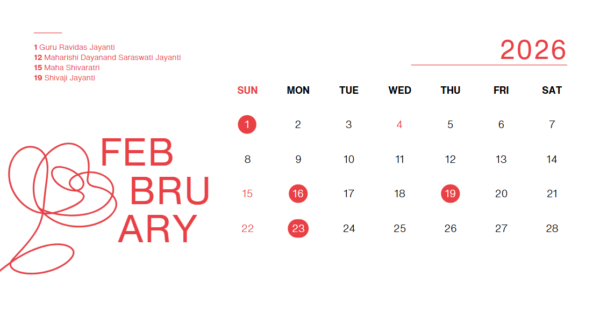

# Calendar – February 2026  
Fundamentals of Web Design (FWD) Assignment  

Submitted by **Jeu Machahary**  
BTech CSE – 4th Semester  

---

# Raw Design



---

# CODE

```html
<!doctype html>
<html lang="en">
<head>
  <meta charset="UTF-8" />
  <link rel="icon" type="image/svg+xml" href="/Calendar-favicon.svg" />
  <meta name="viewport" content="width=device-width, initial-scale=1.0" />
  <title>Calendar</title>
  <link rel="stylesheet" href="/global.css">
</head>

<body>

<div class="wrapper">

  <div class="left">
    <div class="decor-line"></div>

    <div class="holidays">
      <strong>1</strong> Guru Ravidas Jayanti<br>
      <strong>12</strong> Maharishi Dayanand Saraswati Jayanti<br>
      <strong>15</strong> Maha Shivaratri<br>
      <strong>19</strong> Shivaji Jayanti
    </div>

    

    <div class="month-title">
      <span class="feb">FEB</span>
      <span class="rua">RUA</span>
      <span class="ry">RY</span>
    </div>
  </div>

  <div class="right">

    <div class="year">2026</div>
    <div class="year-line"></div>

    <table>
      <thead>
        <tr>
          <th>SUN</th>
          <th>MON</th>
          <th>TUE</th>
          <th>WED</th>
          <th>THU</th>
          <th>FRI</th>
          <th>SAT</th>
        </tr>
      </thead>

      <tbody>
        <tr>
          <td><span class="highlight">1</span></td>
          <td>2</td>
          <td>3</td>
          <td>4</td>
          <td>5</td>
          <td>6</td>
          <td>7</td>
        </tr>
        <tr>
          <td class="sunday">8</td>
          <td>9</td>
          <td>10</td>
          <td>11</td>
          <td><span class="highlight">12</span></td>
          <td>13</td>
          <td>14</td>
        </tr>
        <tr>
          <td class="sunday">15</td>
          <td>16</td>
          <td>17</td>
          <td>18</td>
          <td><span class="highlight">19</span></td>
          <td>20</td>
          <td>21</td>
        </tr>
        <tr>
          <td class="sunday">22</td>
          <td>23</td>
          <td>24</td>
          <td>25</td>
          <td>26</td>
          <td>27</td>
          <td>28</td>
        </tr>
      </tbody>
    </table>

  </div>
</div>

<footer class="footer">
  <div class="footer-content">
    <div class="footer-left">
      <div class="footer-logo">
        
        <h2>Calendar</h2>
      </div>

      <p>
        Calendar is an opensource Fundamentals of Web Design (FWD) Assignment
        submitted by Jeu Machahary, BTech CSE 4th Sem to Mr. Spandan Sir.
      </p>
    </div>

    <div class="footer-right">
      <a href="https://github.com/machahary07/calendar" target="_blank">
        
      </a>

      <p>
        Sourcecode Available in here:<br>
        <a href="https://github.com/machahary07/calendar" target="_blank">
          www.github.com/machahary07/calendar
        </a>
      </p>
    </div>
  </div>

  
</footer>

</body>
</html>
```

---

# OUTPUT

https://calendarbyjeu.netlify.app/